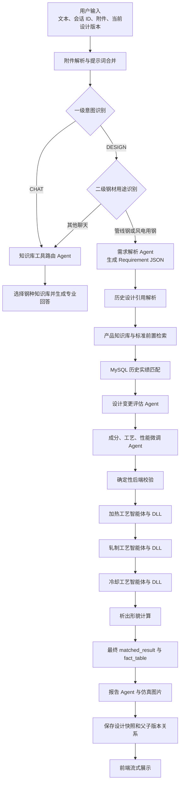

# Steel Agent

面向钢材产品设计与材料专业问答的多智能体系统。项目使用 FastAPI、Vue、LangChain、RAG、历史实绩数据库和专业仿真 DLL，将用户需求逐步转换为成分、加热、轧制、冷却、性能预测及最终设计报告。

> [!IMPORTANT]
> 本仓库是代码与小体量知识资料快照，不是可独立运行的完整交付包。专业模型、完整向量库、历史实绩数据、C# 仿真 DLL 及其运行目录未包含在内，原系统相关数据总量为数十 GB。因此可以阅读代码、构建前端和运行不依赖外部资源的检查，但无法仅凭本仓库完成端到端材料设计。

## 核心能力

- 普通问答与材料设计的一级意图识别
- 管线钢、风电用钢等用途的二级路由
- PDF、DOCX、XLSX、Markdown、文本和图片附件解析
- 钢种知识库自动选择与 RAG 检索
- 结构化需求提取与历史设计续改
- Oracle/MySQL 历史实绩匹配
- 成分、加热、轧制、冷却及性能的多智能体协作
- 确定性规格校验和工艺硬门禁
- 仿真图片、析出形貌与最终报告生成
- NDJSON 流式进度、结果展示和设计版本保存

## 系统流程



## 目录结构

```text
Steel_Agent/
├── api/                         # FastAPI 后端与智能体编排
│   ├── api.py                   # 后端主程序，POST /classify 入口
│   ├── pipeline_agents.py       # 需求、变更评估及加热/轧制/冷却智能体
│   ├── prompt.py                # 系统提示词与各阶段提示词构造
│   ├── store_vectors.py         # MinerU/PDF 解析、Markdown 分块和 PGVector 入库
│   ├── hybrid_retriever.py      # PGVector + BM25 混合检索
│   ├── rag_tools.py             # 各钢种知识库工具
│   ├── design_versioning.py     # 设计快照、父方案和续改关系
│   ├── attachment_*.py          # 临时附件上传与解析
│   ├── markdown/                # 已转换的知识资料
│   ├── chunks_cache_*.json      # BM25 所需的分块缓存
│   ├── docs/                    # 少量 RAG 输入示例 PDF
│   └── tests/                   # 后端单元测试
└── html/                        # Vue 3 + Vite 前端
    ├── src/                     # 页面、聊天、附件和流式状态管理
    ├── dist/                    # 当前前端构建快照
    └── package.json
```

## 重点代码

- `api/api.py`：后端主程序。核心入口为 `POST /classify`，负责意图路由、RAG、实绩匹配、智能体串联、仿真、报告和流式事件。
- `api/store_vectors.py`：将 PDF 等资料转换为 Markdown，执行语义分块，并写入 PostgreSQL/PGVector，同时生成 `chunks_cache_*.json`。
- `api/prompt.py`：系统提示词、需求解析、专业智能体、报告生成和修复提示词。
- `api/pipeline_agents.py`：结构化需求解析、设计变更评估、成分工艺性能微调，以及加热、轧制、冷却三个专业智能体的封装。
- `html/src/components/chat/ChatView.vue`：调用 `/classify` 并消费 NDJSON 流。
- `html/src/components/chat/ChatInput.vue`：附件上传、解析进度和发送队列。

## 知识资料

`api/markdown/` 保存由 RAG 文档转换得到的 Markdown。当前重点目录为：

- `gxg_db`：管线钢标准资料
- `gxg_Know_db`：管线钢专业知识资料
- `jgyg_db`：风电/结构用钢标准资料
- `jgyg_Know_db`：风电/结构用钢专业知识资料

仓库中还保留了工程机械用钢、海工钢、建筑用钢、汽车用钢和桥梁钢等资料目录。实际向量库数据未包含在仓库中。

## 配置

复制环境变量模板，并填入本地实际配置：

```bash
cp api/.env.example api/.env
```

主要配置分为四组：

- `DEEPSEEK_*`、`QWEN_*`：LLM 密钥、兼容接口地址和模型名
- `POSTGRES_*`、`SESSION_DB_NAME`：PGVector、分块入库和会话持久化
- `ORACLE_*`：耐磨钢历史实绩数据
- `PIPELINE_MYSQL_*`：管线钢历史实绩数据

`.env` 已被 Git 忽略。不要提交真实密钥、数据库密码或生产连接信息。

## 本地开发

### 后端

建议在 Windows 环境运行，Python 版本以原部署环境为准：

```bash
cd api
python -m venv .venv
.venv\Scripts\activate
python -m pip install -r requirements.txt
python api.py
```

后端默认监听 `http://localhost:8000`。`requirements.txt` 是基础依赖清单；完整 RAG 和专业仿真还需要 PostgreSQL/pgvector、对应 LangChain 扩展、嵌入模型、MinerU/OCR 模型、Oracle/MySQL 客户端、pythonnet 以及未随仓库提供的专有 DLL。

### 前端

```bash
cd html
npm ci
npm run dev
```

前端当前固定访问 `http://localhost:8000`。生产构建命令为：

```bash
npm run build
```

## RAG 文档入库

1. 将待处理 PDF 放入 `api/docs/`。
2. 在 `api/store_vectors.py` 中选择目标 `DB_NAME`。
3. 配置 PostgreSQL 和 pgvector，并准备 MinerU/OCR 模型。
4. 执行：

```bash
cd api
python store_vectors.py
```

脚本会把 Markdown 写入 `api/markdown/<DB_NAME>/`，生成对应的 `chunks_cache_<DB_NAME>_documents.json`，并将向量写入 PGVector。

## 主要接口

- `POST /classify`：统一智能路由和设计入口，返回 NDJSON 流
- `POST /attachments/upload`：上传临时附件
- `POST /attachments/{attachment_id}/parse`：启动附件解析
- `GET /attachments/{attachment_id}/status`：查询附件解析状态
- `GET /computation-status/{session_id}`：查询后台计算状态
- `GET /computation-stream/{session_id}`：恢复计算结果流
- `GET /generated-images/{token}`：读取受控仿真图片
- `GET /sessions`：调试用会话状态

最小请求示例：

```bash
curl -N http://localhost:8000/classify \
  -H "Content-Type: application/json" \
  -d '{"message":"设计一种 X80 管线钢方案","session_id":"demo-001"}'
```

## 未包含的运行资源

- 加热、轧制、冷却等专业模型及完整模型数据
- PostgreSQL/PGVector 实际向量库
- Oracle/MySQL 历史实绩库及生产数据
- `api/DLL/`、`api/FoundationModel_Deno_New/` 等 C#/.NET 仿真程序和依赖
- `bigmodel_Picture_pre.py` 及析出形貌相关模型资源
- MinerU、OCR、Hugging Face 嵌入模型的本地权重

补齐上述资源并校正本机路径前，完整设计链路无法运行。

## 检查

```bash
# 后端语法与测试
python -m compileall -q api
python -m unittest discover -s api/tests

# 前端
cd html
npm ci
npm run build
```

其中两项析出形貌源码检查依赖未随包提供的 `FoundationModel_Deno_New/` 目录；补齐专有资源前，这两项测试会因文件不存在而失败。

## 许可

仓库当前未附带开源许可证，默认不授予复制、修改或再分发权限。请按项目所有者的内部授权范围使用。
