<!--
本模板由 Steel Multi-Agent System (SMAS)管线(1).docx 转换生成。
模板中的牌号、成分、规格、工艺、性能、标准和分析文字仅用于固定章节、表格、图片与题注位置。
生成新报告时严禁复制示例数值；必须以本轮 fact_table、spec_result、上下文和实际仿真图片为唯一事实来源。
-->

# 管线钢热轧工艺设计报告

## 1. 设计目标与方案概述

　　本方案针对X90超高强度管线钢的30 mm厚规格产品开展热轧工艺设计。X90是API 5L标准中的超高强度管线钢级别，规定最小屈服强度625 MPa，主要用于高压力、大直径天然气长输管道工程。设计采用厚度350 mm、宽度2600 mm、长度3482 mm的连铸板坯为原料，轧制成品目标厚度30 mm、目标宽度3520 mm。根据X90规格边界的技术要求，力学性能标准为：屈服强度（YS）625-775 MPa，抗拉强度（TS）695-915 MPa，延伸率（EL）不低于16%，冲击功（AKV）不低于40 J。

<strong>表1 力学性能标准</strong>

| 力学性能项目 | 标准下限 | 标准上限 | 单位 |
|:---:|:---:|:---:|:---:|
| 屈服强度 YS | 625.0 | 775.0 | MPa |
| 抗拉强度 TS | 695.0 | 915.0 | MPa |
| 断后伸长率 EL | 16.0 | - | % |
| 冲击功 AKV | 40.0 | - | J |

　　为实现上述规格与性能目标，本方案采用低碳微合金化成分设计与热机械控制工艺（TMCP）相结合的总体技术路线。成分设计以C-Mn为基体，利用Nb-V-Ti微合金化和Cr-Mo-Ni-Cu复合合金化，通过固溶强化、析出强化、细晶强化与位错强化的多机制协同获得高强度与高韧性的匹配；工艺路线采用“三段加热+均热”的厚板坯加热制度，使微合金元素充分固溶并控制奥氏体晶粒尺寸；11道次粗轧在完全再结晶区完成奥氏体晶粒细化，7道次精轧在未再结晶区累积变形，随后经加速冷却获得以粒状贝氏体与针状铁素体为主的细晶组织。

　　本方案最终确定的加热、轧制和冷却关键参数为：均热温度1155℃、均热时间55 min，粗轧入口温度约1035℃、中间坯厚度 79 mm，精轧入口温度FET=865℃、终轧温度FDT=795℃，冷却入水温度775℃、返红温度440℃，成品厚度30 mm。设计性能结果为YS=665 MPa、TS=785 MPa、EL=22.50%、AKV=285 J，各项指标均满足X90管线钢标准要求。

<strong>表2 成分、工艺与性能参数</strong>

| 类别 | 项目 | 数值 | 单位 |
|:---:|:---:|:---:|:---:|
| 成分 | C | 0.0650 | wt% |
| 成分 | SI | 0.2500 | wt% |
| 成分 | MN | 1.8500 | wt% |
| 成分 | P | 0.0100 | wt% |
| 成分 | S | 0.0010 | wt% |
| 成分 | N | 0.0030 | wt% |
| 成分 | NB | 0.0650 | wt% |
| 成分 | V | 0.0450 | wt% |
| 成分 | TI | 0.0150 | wt% |
| 成分 | CU | 0.1500 | wt% |
| 成分 | CR | 0.2500 | wt% |
| 成分 | NI | 0.2000 | wt% |
| 成分 | MO | 0.2500 | wt% |
| 成分 | B | 0.0000 | wt% |
| 工艺 | 板坯厚度 | 350.00 | mm |
| 工艺 | 板坯宽度 | 2600.00 | mm |
| 工艺 | 板坯长度 | 3482.00 | mm |
| 工艺 | 板坯长度 | 3482.00 | mm |
| 工艺 | 成品厚度 | 30.00 | mm |
| 工艺 | 均热温度 | 1155 | ℃ |
| 工艺 | 精轧开轧温度 FET | 865 | ℃ |
| 工艺 | 精轧终轧温度 FDT | 795 | ℃ |
| 工艺 | 入水温度 TEMP_ENTR | 775 | ℃ |
| 工艺 | 返红温度 SELF_TEMP | 440 | ℃ |
| 力学性能 | 屈服强度 YS | 665 | MPa |
| 力学性能 | 抗拉强度 TS | 785 | MPa |
| 力学性能 | 断后伸长率 EL | 22.50 | % |
| 力学性能 | 冲击功 AKV | 285 | J |

## 2. 化学成分设计与作用

　　管线钢的化学成分设计是获得目标组织和性能的基础。本方案X90管线钢采用低碳高锰的合金化思路，利用Nb-V-Ti微合金化与Cr-Mo-Ni-Cu复合合金化的协同作用，实现X90级别高强度与高韧性的平衡。主要化学成分包括C=0.0650 wt%、Si=0.2500 wt%、Mn=1.8500 wt%、P=0.0100 wt%、S=0.0010 wt%、N=0.0030 wt%，微合金元素Nb=0.0650 wt%、V=0.0450 wt%、Ti=0.0150 wt%，以及合金元素Cr=0.2500 wt%、Mo=0.2500 wt%、Ni=0.2000 wt%、Cu=0.1500 wt%、Co=0.0050 wt%，Al=0.0300 wt%（Als=0.0280 wt%）。

　　碳含量C=0.0650 wt%属于低碳设计范畴，其作用体现在三个方面：一是保证30 mm厚规格在加速冷却条件下具有足够的淬透性，促进贝氏体和针状铁素体转变；二是显著降低焊接冷裂纹敏感性和热影响区（HAZ）硬化倾向，改善焊接性；三是抑制渗碳体和粗大马氏体/奥氏体（M/A）组元的形成，保护低温韧性。

　　锰含量Mn=1.8500 wt%是管线钢最主要的强化元素，通过固溶强化和降低γ→α相变温度细化铁素体晶粒，同时扩大奥氏体稳定区，有利于在中等冷速下获得针状铁素体组织。硅含量Si=0.2500 wt%主要起脱氧和固溶强化作用，含量适中以避免对表面质量和焊接性的不利影响。

　　磷、硫为严格控制的有害元素，P=0.0100 wt%、S=0.0010 wt%。低磷含量避免晶界偏析引起的韧性下降，低硫含量减少 MnS夹杂物并改善抗氢致开裂（HIC）性能。氮含量N=0.0030 wt%处于较低水平，避免固溶氮导致应变时效和韧性恶化，同时与 Ti、Al结合形成氮化物发挥有益作用。

　　Nb=0.0650 wt%是控轧控冷工艺中最重要的微合金元素。Nb在加热阶段固溶于奥氏体，在轧制过程中特别是精轧温度区间发生应变诱导析出，强烈抑制奥氏体再结晶，是保证未再结晶区控轧和奥氏体晶粒扁平化的关键元素；V=0.0450 wt%在铁素体相变后析出V(C,N)，在中温区间提供补充析出强化；Ti=0.0150 wt%形成高熔点TiN颗粒，在加热和焊接过程中钉扎奥氏体晶界，抑制晶粒粗化。

　　Cr=0.2500 wt%与Mo=0.2500 wt%复合添加，显著提高过冷奥氏体稳定性，抑制高温铁素体-珠光体转变，促进粒状贝氏体和针状铁素体形成，其中Mo还能优化M/A组元形态，改善强韧性匹配；Ni=0.2000 wt%提高低温韧性和淬透性，对改善厚规格心部性能有益；Cu=0.1500 wt%通过固溶强化和时效析出贡献强度，其含量适中以避免铜脆倾向。

　　铝含量Alt=0.0300 wt%、Als=0.0280 wt%，通过AlN细晶作用细化奥氏体晶粒并固定固溶氮，同时起到深度脱氧作用。 Co=0.0050 wt%为微量元素，B=0.0000 wt%表明本方案不添加硼，避免B的析出物对韧性的不利影响。

## 3. 加热工艺制度的解析

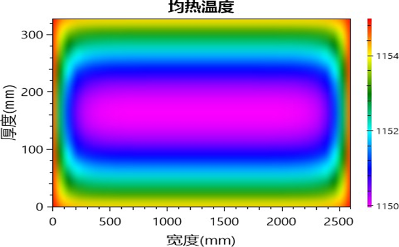

<strong>图1 加热炉均热段板坯横截面温度场</strong>

　　工艺支持分析： 该图用于验证均热段温度场均匀性，为全固溶温度达成、元素固溶和异常晶粒长大控制提供工艺依据。

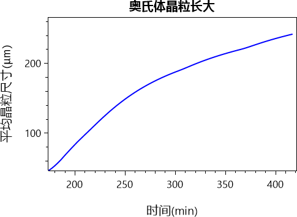

<strong>图2 加热过程奥氏体晶粒长大</strong>

　　工艺支持分析： 该图用于评估加热和高温停留过程中晶粒长大风险，支撑均热温度和均热时长是否需要保守控制。

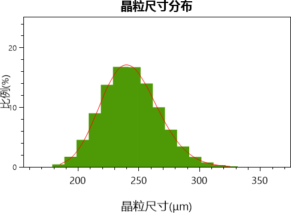

<strong>图3 加热炉出炉奥氏体晶粒尺寸分布</strong>

　　工艺支持分析： 该图用于判断最终晶粒尺寸分布是否均匀，支撑方案是否具备细晶强化和韧性稳定性基础。

　　加热工艺是TMCP过程的源头环节，其任务是为控制轧制提供固溶充分、温度均匀且晶粒尺寸适宜的初始奥氏体状态。对于 350 mm超厚板坯，加热制度的制定需要同时满足三个约束：一是均热温度必须高于Nb、V碳氮化物的全固溶温度，以保证微合金元素在轧前完全回溶；二是厚板坯心部必须充分透热，缩小心表温差；三是均热温度和保温时间不能导致奥氏体晶粒过度粗化。

　　本方案均热温度SOAK_TEMP=1155℃，出炉温度FURNACE_EXIT_TEMP=1155℃。模拟计算表明，本钢种微合金碳氮化物的全固溶温度约为1134.9℃，均热温度高于全固溶温度约20℃，能够确保Nb、V等微合金元素的碳氮化物完全溶解，为后续控轧过程中的应变诱导析出和析出强化提供固溶储备。

　　在加热制度上采用“预热段-三个加热段-均热段”的梯级升温模式：预热段温度PRE_HEAT_TEMP=413℃、时间

　　PRE_HEAT_TIME=127 min，完成板坯的缓慢升温和应力释放；第一加热段温度1125℃、时间82 min，第二加热段温度1135℃、时间91 min，第三加热段温度1145℃、时间62 min，各加热段与均热段之间温差控制在10-20℃范围内，形成平滑的升温曲线，降低厚板坯加热过程中的热应力。均热时间SOAK_TIME=55 min，通过适中的保温时长兼顾心部透热与晶粒控制。

　　均热温度场仿真结果表明，在1155℃×55 min的均热制度下，350 mm厚板坯心部温度充分接近表面温度，心表温差得到有效控制，板坯整体处于均匀的奥氏体化状态。全固溶温度的达成与温度均匀性的改善，为后续轧制过程中组织与性能的均匀性奠定了温度基础。

　　晶粒长大与晶粒尺寸分布仿真结果显示，在均热过程中奥氏体晶粒呈现规律性长大，晶粒尺寸分布保持单峰正态特征，无明显异常粗大晶粒。相较于更高温度的加热制度，1155℃的均热温度与55 min的均热时间在保证全固溶的前提下，将奥氏体晶粒粗化风险控制在可接受范围，为粗轧阶段的再结晶细化提供了合理的初始晶粒尺寸。

## 4. 控制轧制工艺制度的解析

<strong>表3 设计轧制规程</strong>

| 道次 | 阶段 | 出口厚度/mm | 道次压下量/mm | 变形温度/ ℃ | 出口宽度/mm | 轧制速度/(m/s) | 轧制力/kN | 扭 矩/(kN·m) |
|:---:|:---:|:---:|:---:|:---:|:---:|:---:|:---:|:---:|
| 1 | 粗轧 | 295.00 | 55.00 | 1035.00 | 2645.00 | 0.92 | 38500.00 | 15471.1 |
| 2 | 粗轧 | 274.00 | 21.00 | 1020.00 | 3520.00 | 1.48 | 56000.00 | 8868.82 |
| 3 | 粗轧 | 254.00 | 20.00 | 1005.00 | 3520.00 | 1.48 | 54000.00 | 8531.07 |
| 4 | 粗轧 | 235.00 | 19.00 | 995.00 | 3520.00 | 1.48 | 53000.00 | 8190.66 |
| 5 | 粗轧 | 217.00 | 18.00 | 985.00 | 3520.00 | 1.00 | 46000.00 | 7847.25 |
| 6 | 粗轧 | 195.00 | 22.00 | 985.00 | 3520.00 | 1.50 | 55000.00 | 9476.32 |
| 7 | 粗轧 | 170.00 | 25.00 | 965.00 | 3520.00 | 1.50 | 53000.00 | 10661.7 |
| 8 | 粗轧 | 148.00 | 22.00 | 960.00 | 3520.00 | 1.50 | 55000.00 | 9610.76 |
| 9 | 粗轧 | 123.00 | 25.00 | 965.00 | 3520.00 | 1.75 | 58000.00 | 10722.3 |
| 10 | 粗轧 | 100.00 | 23.00 | 975.00 | 3520.00 | 1.75 | 60000.00 | 10021.6 |
| 11 | 粗轧 | 79.00 | 21.00 | 985.00 | 3520.00 | 3.00 | 64000.00 | 9294.84 |
| 12 | 精轧 | 69.00 | 10.00 | 860.00 | 3520.00 | 2.83 | 78000.00 | 9106.59 |
| 13 | 精轧 | 60.00 | 9.00 | 840.00 | 3520.00 | 3.08 | 80000.00 | 8435.1 |
| 14 | 精轧 | 52.00 | 8.00 | 825.00 | 3520.00 | 3.17 | 75000.00 | 7567.31 |
| 15 | 精轧 | 45.00 | 7.00 | 815.00 | 3520.00 | 3.25 | 70000.00 | 6866.01 |
| 16 | 精轧 | 38.00 | 7.00 | 805.00 | 3520.00 | 3.50 | 65000.00 | 6970.19 |
| 17 | 精轧 | 34.00 | 4.00 | 800.00 | 3520.00 | 4.50 | 58000.00 | 4431.31 |
| 18 | 精轧 | 30.00 | 4.00 | 795.00 | 3520.00 | 4.83 | 48000.00 | 4515.63 |
| 19 | 粗轧 | 123.00 | 25.00 | 965.00 | 3520.00 | 1.75 | 58000.00 | 10722.3 |

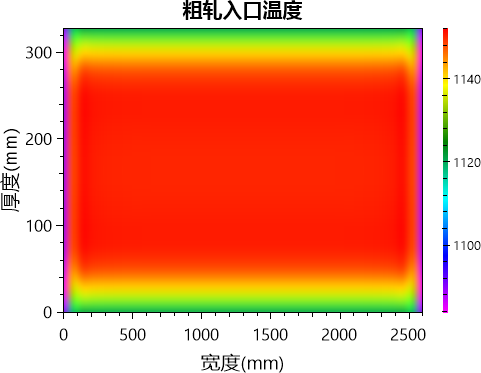

<strong>图4 粗轧入口轧件横截面温度场</strong>

　　工艺支持分析： 该图用于判断粗轧入口温度是否满足再结晶区变形需求，支撑粗轧阶段晶粒破碎和初始奥氏体组织均匀化。

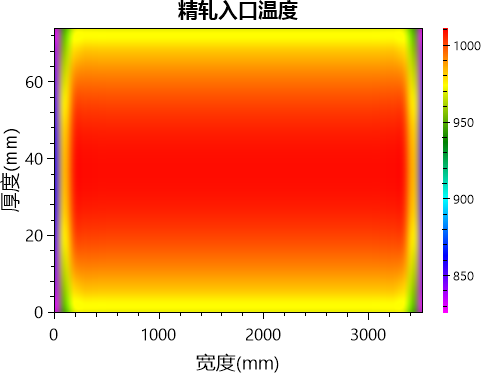

<strong>图5 精轧入口轧件横截面温度场</strong>

　　工艺支持分析： 该图用于判断精轧入口温度是否进入适宜控轧窗口，支撑未再结晶区变形累积和后续晶粒细化。

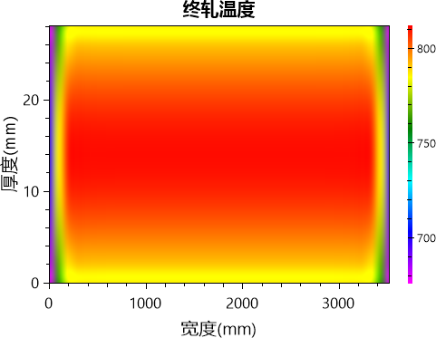

<strong>图6 终轧出口轧件横截面温度场</strong>

　　工艺支持分析： 该图用于验证终轧温度与目标 TMCP 路径是否匹配，支撑形变奥氏体向细小铁素体/贝氏体组织转变。

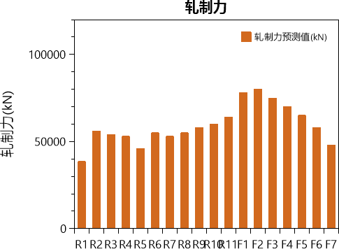

<strong>图7 轧件各道次轧制力计算值</strong>

　　工艺支持分析： 该图用于核对各道次轧制负荷与压下量、板宽、变形温度和平均变形抗力的匹配关系，支撑粗精轧负荷分配及设备能力校核。

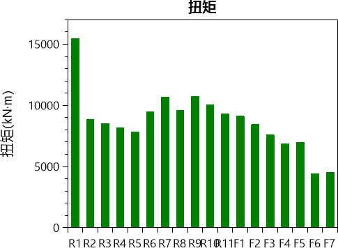

<strong>图8 轧件各道次扭矩计算值</strong>

　　工艺支持分析： 该图用于核对各道次传动扭矩与轧制力、接触弧长和轧制速度的协同关系，支撑主传动负荷及轧制规程可执行性判断。

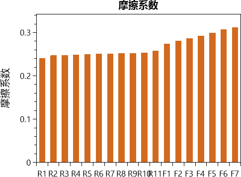

<strong>图9 轧件各道次轧制摩擦系数</strong>

　　工艺支持分析： 该图用于分析各道次轧辊与轧件界面的摩擦条件变化，支撑咬入稳定性、轧制力和扭矩计算依据的合理性判断。

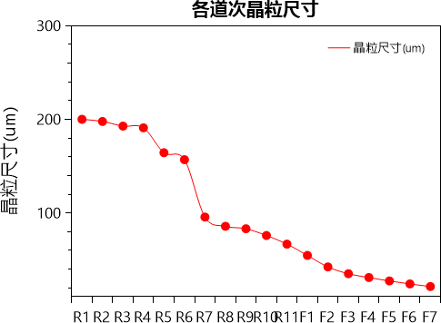

<strong>图10 各道次奥氏体晶粒尺寸</strong>

　　工艺支持分析： 该图用于验证各轧制道次晶粒演化是否连续合理，支撑道次压下、轧制温度、速度和轧制力分配的协同有效性。

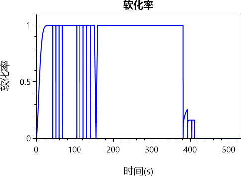

<strong>图11 各道次软化率</strong>

　　工艺支持分析： 该图用于分析轧制过程中再结晶与软化行为，支撑控轧温度窗口和道次间隔是否有利于变形累积。

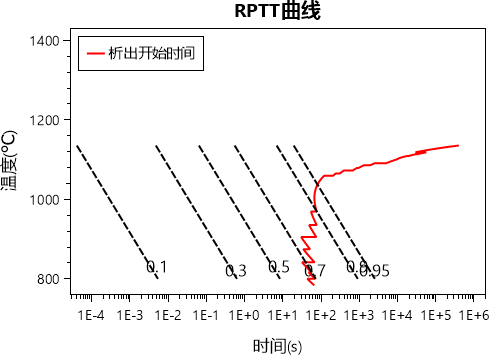

<strong>图12 RPTT</strong>

　　工艺支持分析： 该图用于分析轧制过程中再结晶与析出的温度-时间耦合关系，支撑控轧温度窗口、道次间隔和微合金析出时序的合理性判断。

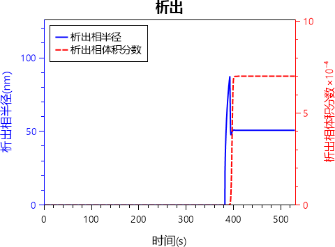

<strong>图13 微合金碳氮化物析出动力学</strong>

　　工艺支持分析： 该图用于评估微合金碳氮化物析出时机和强化贡献，支撑 Nb、V、Ti 等元素与控轧控冷工艺的匹配性。

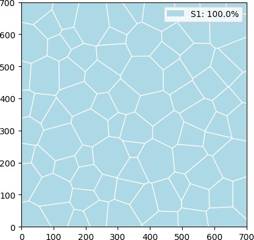

<strong>图14 粗轧出口奥氏体晶粒形貌</strong>

　　工艺支持分析： 该图用于观察粗轧出口奥氏体晶粒形貌和均匀性，支撑粗轧再结晶、晶粒破碎及后续精轧初始组织条件的合理性判断。

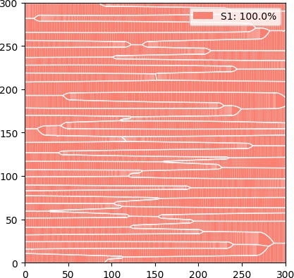

<strong>图15 精轧出口奥氏体晶粒形貌</strong>

　　工艺支持分析： 该图用于观察精轧出口奥氏体晶粒细化与形变状态，支撑未再结晶区累积变形和最终组织细化效果的合理性判断。

　　控制轧制是TMCP的核心环节，其目的在于通过“完全再结晶区粗轧+未再结晶区精轧”的两阶段变形，将加热后的粗大奥氏体晶粒逐步细化，并在精轧阶段通过未再结晶区变形累积为相变提供高密度形核位置。本方案采用11道次粗轧与7道次精轧共18道次的轧制规程，将350 mm厚板坯轧至30 mm成品。粗轧阶段累计压下量271 mm、总压下率约77.4%，中间坯厚度79 mm；精轧阶段累计压下量49 mm、总压下率约62.0%。

　　粗轧阶段（N1-N11）变形温度为960-1035℃，处于奥氏体完全再结晶区。第一道次N1以55 mm的大压下量将350 mm板坯轧至295 mm，变形温度1035℃，轧制力38500 kN、扭矩15471.1 kN·m，该道次接触弧长最大、轧制力矩为全规程峰值，其大压下变形有效破碎铸态枝晶组织，为后续再结晶细化创造条件。N2道次出口宽度由2645 mm变为3520 mm，表明在N2前完成 90°转钢，轧制方向由板坯长度方向转为宽度方向继续展宽轧制；转钢后N2-N11各道次出口宽度均稳定保持3520 mm，与成品目标宽度一致，符合体积守恒规律。

　　粗轧第2-11道次压下量为18-25 mm，变形温度由1020℃逐步过渡到约985℃，轧制力为46000-64000 kN，扭矩约7800- 10700 kN·m。粗轧各道次轧制力随道次推进总体呈上升趋势，反映累计压下量增加和变形温度降低引起的变形抗力增大，其中第

　　11道次（出口79 mm）轧制力达64000 kN、扭矩约9300 kN·m，粗轧末道次的负荷水平处于设备能力合理范围内。粗轧道次间发生充分的动态与静态再结晶，奥氏体晶粒通过反复形核与长大得到逐步细化。

　　精轧阶段（N12-N18）将79 mm中间坯轧至30 mm成品，精轧入口温度FET=865℃，终轧温度FDT=795℃。各道次变形温度依次为860℃、840℃、825℃、815℃、805℃、800℃、795℃，沿轧制方向单调递减且全部处于未再结晶区温度范围，避免了道次间再结晶软化，确保变形带和位错在奥氏体晶粒内持续累积。精轧前段N12-N16道次保持7-10 mm的较大压下量促进变形累积；N17-N18道次压下量为4 mm，以平整校形为主，保障成品厚度精度与板形。精轧轧制力为48000-80000 kN，其中N13道次（出口60 mm、变形温度840℃）轧制力达峰值80000 kN，这与该道次坯厚60 mm时变形渗透困难、9 mm大压下量以及微合金应变诱导析出导致的变形抗力上升有关；末道次N18轧制力降至48000 kN。

　　从力学与传动负荷的匹配看，精轧道次轧制速度为2.83-4.83 m/s，扭矩为4500-9100 kN·m。精轧阶段轧制力较大而扭矩相对适中，反映了轧件薄、接触弧短、力臂小的高轧制力-低力矩特征。摩擦系数仿真结果显示，粗轧道次温度高、界面氧化铁皮状态稳定，摩擦系数水平较高，有利于大压下咬入；精轧道次随轧制速度升高，摩擦系数趋于下降，但仍保持稳定轧制所需的摩擦条件。整体上，轧制力、扭矩与摩擦条件在各道次间匹配合理，设备能力可以支撑本规程的负荷需求。

　　各道次晶粒尺寸仿真结果显示，粗轧阶段奥氏体晶粒由初始粗大状态逐步细化，在粗轧中后段降至100 μm以下；精轧阶段在未再结晶区变形累积作用下，晶粒被进一步压扁细化，至精轧出口奥氏体晶粒约为30 μm，晶粒尺寸演化连续、无异常突变。软化率仿真结果表明，粗轧道次间软化率较高、再结晶充分，精轧道次间软化率显著降低，证实未再结晶区轧制有效地保留了变形储 能。RPTT与析出动力学仿真结果显示，Nb、V碳氮化物在精轧温度区间具有明显的应变诱导析出驱动力，析出相通过钉扎晶界和位错进一步抑制再结晶，与轧制工艺形成良好的时序匹配。粗轧出口与精轧出口奥氏体晶粒形貌仿真结果也表明，两阶段控轧后的奥氏体状态满足X90管线钢对细晶强韧化的组织要求。

## 5. 控制冷却工艺制度的解析

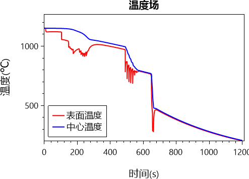

<strong>图16 轧制全流程温度场曲线</strong>

　　工艺支持分析： 该图用于综合验证加热、轧制、冷却全流程温度连续性，支撑成分-工艺-组织协同设计的热历程合理性。

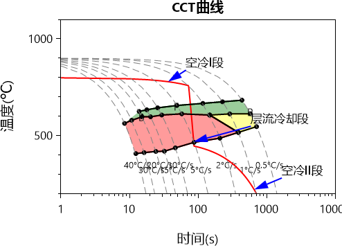

<strong>图17 相变CCT曲线</strong>

　　工艺支持分析： 该图用于判断连续冷却过程中的相变路径，支撑冷却制度对铁素体、针状铁素体或贝氏体组织比例的控制。

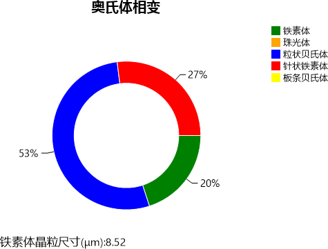

<strong>图18 轧件最终相组成</strong>

　　工艺支持分析： 该图用于验证冷却后组织相比例是否合理，支撑返红温度和冷却路径对最终强韧性匹配的贡献。

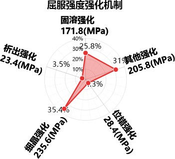

<strong>图19 产品屈服强度强化机制</strong>

　　工艺支持分析： 该图用于核对固溶强化、析出强化、细晶强化、位错强化及其他强化贡献与最终屈服强度的一致性，支撑成分、组织和性能协同关系判断。

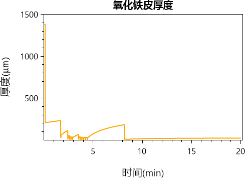

<strong>图20 轧制全流程轧件氧化铁皮厚度</strong>

　　工艺支持分析： 该图用于综合评估加热、轧制和冷却全过程的氧化铁皮控制水平，支撑温度制度、除鳞效果及最终表面质量判断。

　　控制冷却决定最终相变组织与力学性能，是TMCP工艺的收尾环节。本方案采用加速冷却模式（COOL_TYPE=2），冷却区辊道速度SPEED=1.15 m/s，开冷温度TEMP_ENTR=775℃，返红温度SELF_TEMP=440℃。

　　终轧后轧件以1.15 m/s的速度进入冷却装置，由775℃加速冷却至440℃后返红空冷。从FDT=795℃到入水温度775℃之间约 20℃的温降，是轧后输送过程中的自然空冷结果，符合30 mm厚规格管线钢的输送温降规律。温度场曲线仿真结果显示，加热、轧制、冷却全流程的温度历程连续合理，冷却段温度变化平稳，无异常温度反复，为组织均匀性提供了保证。

　　连续冷却相变路径分析表明，本方案的冷却曲线在CCT图中由775℃向440℃快速穿过高温铁素体转变区间，在针状铁素体和贝氏体转变区间完成主要相变。440℃的返红温度低于贝氏体转变结束温度区间，保证γ→α相变在较低温度下充分进行，抑制了粗大多边形铁素体的形成，促进了以粒状贝氏体和针状铁素体为主的低温转变组织。

　　相组成仿真结果显示，最终组织以粒状贝氏体和针状铁素体为主，含少量多边形铁素体。粒状贝氏体通过M/A组元和亚结构提供高强度贡献，针状铁素体以其高位错密度和细小板条保证强韧性匹配，少量多边形铁素体有助于维持一定的均匀变形能力。该组织构成是X90管线钢典型的高强高韧组织形态。

　　强化机制仿真结果表明，细晶强化是屈服强度的最大贡献项，来源于控轧得到的细小奥氏体晶粒遗传至相变组织的细晶效应；固溶强化由Mn、Si、Cr、Mo、Ni等合金元素提供，构成强度的稳定基础；位错强化来自未再结晶区精轧变形和低温相变的位错继承；析出强化由Nb、V碳氮化物在轧制和冷却过程中的析出贡献。各强化贡献与最终屈服强度YS=665 MPa具有良好的一致性，验证了本方案成分-工艺-组织的协同有效性。

　　氧化铁皮厚度仿真结果显示，最终成品的氧化铁皮厚度处于合理水平。加热阶段较低的均热温度1155℃和适中的均热时间55 min减少了板坯氧化烧损；轧制过程中N2、N6、N12道次前设置的除鳞操作有效去除了表面一次和二次氧化铁皮；控制冷却阶段形成的氧化铁皮层较薄且均匀。合理的氧化铁皮控制对成品表面质量和后续涂敷、防腐作业的工艺可执行性具有积极的支持作用。

## 6. 成分-工艺-组织-性能协同分析

　　本方案将低碳微合金化成分设计与TMCP工艺路线相结合，实现了X90管线钢30 mm厚规格的高强高韧匹配，其协同关系体现在成分-工艺-组织-性能的完整传递链条中。

　　成分与工艺的协同方面，C=0.0650 wt%的低碳设计为贝氏体转变提供基础淬透性，同时保证焊接性和韧性；Mn=1.8500 wt%与Cr=0.2500 wt%、Mo=0.2500 wt%共同提高过冷奥氏体稳定性，使30 mm厚板在加速冷却条件下能够以合理的冷速获得贝氏体/针状铁素体主导组织；Nb=0.0650 wt%在1155℃均热时充分固溶、在精轧未再结晶区应变诱导析出，与V=0.0450 wt%的相变后析出和Ti=0.0150 wt%的高温钉扎作用形成时序互补，充分发挥了微合金化的多阶段强化潜力。

　　工艺与组织的协同方面，1155℃均热保证固溶并控制初始晶粒；粗轧11道次在960-1035℃完全再结晶区反复细化奥氏体，中间坯厚度79 mm；精轧7道次在795-860℃未再结晶区累积变形，终轧温度795℃，形成高密度变形带与位错亚结构的扁化奥氏体；冷却阶段以775℃开冷、440℃返红加速冷却，使相变在较低温度完成，最终形成以粒状贝氏体为主、针状铁素体次之、含少量多边形铁素体的细晶组织。

　　组织与性能的协同方面，粒状贝氏体和针状铁素体为基体的组织形态同时提供了高强度和良好的韧性：细小的有效晶粒尺寸保障了细晶强化与韧化，M/A组元的弥散分布贡献了沉淀强化与位错强化，而低碳低杂质的基体保证了冲击韧性不因强度提升而劣化。本方案最终力学性能为YS=665 MPa、TS=785 MPa、EL=22.50%、AKV=285 J。其中屈强比约0.85，强度水平处于X90标准中部偏上区域，延伸率较标准下限（≥16%）保持6.5个百分点以上的塑性裕度。

　　低温韧性方面，AKV=285 J远超X90标准要求的40 J下限，表明本方案的抗脆断储备充足。这一韧性水平的获得主要归因于： C=0.0650 wt%低碳设计避免粗大渗碳体和过量M/A组元的韧性损害；P=0.0100 wt%、S=0.0010 wt%低杂质含量保证基体洁净度；N=0.0030 wt%低氮减少固溶氮的有害作用；Ti=0.0150 wt%形成的TiN钉扎加热与焊接过程的晶界迁移；控轧控冷获得的细小均匀组织有效缩短了有效解理单元尺寸。30 mm厚规格在本工艺下仍保持了较高的厚度方向组织均匀性，有利于全厚度性能的一致性。

## 7. 结论

　　本方案针对X90管线钢30 mm厚规格，设计了C=0.0650 wt%、Si=0.2500 wt%、Mn=1.8500 wt%、Nb=0.0650 wt%、 V=0.0450 wt%、Ti=0.0150 wt%、Cr=0.2500 wt%、Mo=0.2500 wt%等组成的低碳微合金化成分体系，采用1155℃×55 min的均热制度、11道次粗轧与7道次精轧的18道次控轧制度（粗轧960-1035℃、精轧795-860℃，FET=865℃、FDT=795℃、中间坯79 mm），以及775℃开冷、440℃返红的加速冷却制度，获得以粒状贝氏体和针状铁素体为主的细晶组织，最终性能为 YS=665 MPa、TS=785 MPa、EL=22.50%、AKV=285 J，全面满足X90管线钢标准要求。

　　拉伸性能评价： 本方案典型成分和工艺对拉伸性能的作用路径清晰：C=0.0650 wt%低碳设计保证淬透性与韧性平衡， Mn=1.8500 wt%、Si=0.2500 wt%提供稳定固溶强化；Nb=0.0650 wt%通过未再结晶区应变诱导析出抑制再结晶、促进晶粒细化，与V=0.0450 wt%的析出强化和Ti=0.0150 wt%的晶粒钉扎作用形成微合金化协同；粗轧11道次在完全再结晶区的反复再结晶细化与精轧7道次在未再结晶区的累积变形相结合，使奥氏体晶粒细化至约30 μm水平，终轧后经775℃开冷、440℃返红的加速冷却，获得粒状贝氏体+针状铁素体的细晶组织，细晶强化、位错强化、固溶强化和析出强化共同作用。由此得到本方案最终拉伸性能为YS=665 MPa、TS=785 MPa、EL=22.50%，与X90标准（YS 625-775 MPa、TS 695-915 MPa、EL≥16%）相比，屈服强度具有40 MPa的富余量、抗拉强度具有90 MPa的富余量，延伸率高于标准下限6.5个百分点，强塑性匹配良好。

　　焊接性能评价： 本方案的成分体系对焊接性具有较好的冶金基础。C=0.0650 wt%的低碳设计显著降低了焊接HAZ淬硬倾向和冷裂纹敏感性；P=0.0100 wt%、S=0.0010 wt%的低磷低硫控制提高钢质洁净度，减少热裂纹和层状撕裂风险；N=0.0030 wt%低氮有利于保护焊缝与HAZ韧性；Nb=0.0650 wt%和V=0.0450 wt%在提高强度的同时可能增加HAZ硬化倾向，但 Ti=0.0150 wt%形成的高熔点TiN能够有效钉扎HAZ奥氏体晶界，抑制焊接热循环下的晶粒粗化，改善HAZ低温韧性；Cr=0.2500 wt%、Mo=0.2500 wt%、Ni=0.2000 wt%、Cu=0.1500 wt%的复合合金化贡献强度的同时，也会在一定程度上提高碳当量水 平，现场焊接时应合理控制热输入和层间温度，并视厚规格的拘束条件采取适当预热措施，以降低冷裂纹风险。总体而言，本方案低碳低杂质的成分设计与TMCP工艺获得的细小均匀组织，为X90管线钢的接头强韧性匹配和现场焊接适应性提供了良好条件，焊接工艺控制方向明确。

## 8. 参考文献

1. 翟有有,胡明.管线钢L450M落锤试验性能波动原因浅析[J].甘肃冶金,2025,47(1):103-106.
2. 秦玉琴.Cr含量对X80管线钢环焊接头热影响区组织和韧性的影响[D].昆明理工学,2025.
3. 武晓龙,周玉青,杨玉厚,等.管线钢连续冷却相变行为及组织演变规律研究[J].热加工工艺,2025,54(13):82-88.
4. 李波,孟庆义,孟庆勇,等.高级别管线钢成分及洁净度的控制研究[J].河南冶金,2025,33(2):17-21.
5. 郭泽禹.基于晶体塑性的X80管线钢疲劳寿命预测研究[D].燕山大学,2025.

Steel Multi-Agent System (SMAS)
2026年08月13日

